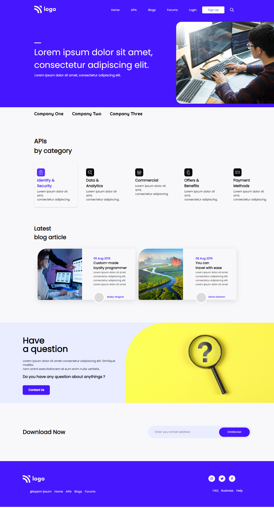

# Project_01 - HTML  and CSS 

---

## Project 01 [Live Link](https://project-01-themohitgupta.netlify.app)

---
## What I learned from this Project?

- Learnd about **css position**.
- Learnd about **pseudo classes**.
- Learnd about **pseudo elements**.

---

### This Project too me around **5 hours** to complete.

---

---
